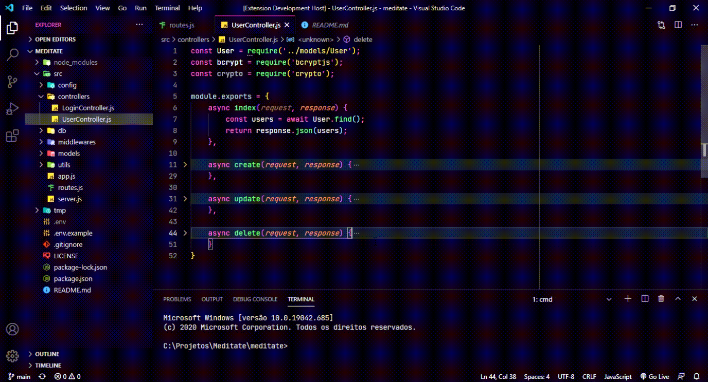

<h1 align="center">
    
    Noturnal
</h1>

    Just a preview.
    

# Overview

A dark theme from Visual Studio Code

- [How to install?](#how-to-install)
- [I need a help](#need-help)
- [License](#license)

# Need help

If you need help with Noturnal, feel free to send an email to 

# How to Install
### [Visual Studio Code](https://code.visualstudio.com/)

#### Install using Command Palette

1.  Go to `View -> Command Palette` or press `Ctrl+Shift+P`
2.  Then enter `Install Extension`
3.  Write `Noturnal`
4.  Select it or press Enter to install

#### Install using Git

If you are a git user, you can install the theme and keep up to date by cloning the repo:

    $ git clone https://github.com/rodrigoge/noturnal-theme.git ~/.vscode/extensions/noturnal-theme
    $ cd ~/.vscode/extensions/noturnal
    $ npm install
    $ npm run build

#### Activating theme

Run Visual Studio Code. The Noturnal theme will be available from `File -> Preferences -> Color Theme` dropdown menu.

# License

MIT © 
This project was developed using the license from MIT. See more about the [LICENSE](https://github.com/rodrigoge/noturnal-theme/blob/master/LICENSE) for more information.

Made with 💜 by [Rodrigo Gouveia.]  ✌️
